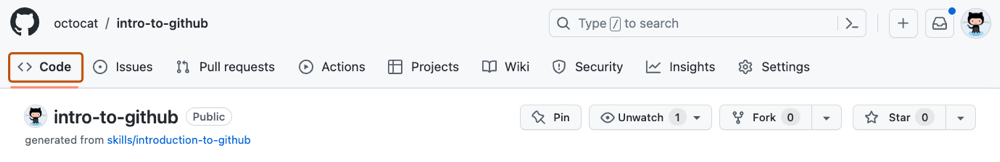

## Étape 1 : créer une branche

Bienvenue dans ta première manipulation GitHub.

### Un dépôt et sa branche principale

Le **dépôt** est le projet que tu viens de créer à partir du dépôt modèle. GitHub y stocke les fichiers et leur historique.

Un dépôt peut avoir plusieurs **branches**. Une branche est une version parallèle du projet : elle permet de préparer un changement sans modifier immédiatement la version de référence.

Dans ce dépôt, la branche de référence s'appelle `main`.

### Pourquoi créer une branche ?

Imagine `main` comme la version actuellement validée du projet. Pour essayer une modification, on travaille généralement ailleurs puis on décide plus tard si cette modification doit rejoindre `main`.

Pour cet exercice, tu vas créer :

```text
my-first-branch
```

### Activité : créer `my-first-branch`

1. Ouvre la page principale du dépôt dans un nouvel onglet.
2. Vérifie que tu es dans l'onglet **Code**.

   

3. Ouvre le menu qui affiche actuellement `main`.

   

4. Dans **Find or create a branch...**, saisis exactement `my-first-branch`.
5. Clique sur **Create branch: my-first-branch from main**.

   

GitHub bascule automatiquement sur la nouvelle branche.

> [!IMPORTANT]
> Le nom `my-first-branch` est utilisé par l'automatisation du cours. Utilise exactement ce nom.

Une fois la branche créée sur GitHub, Mona détectera l'action et publiera automatiquement l'étape suivante ici.
