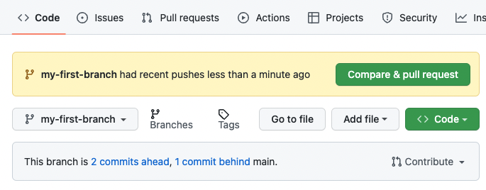
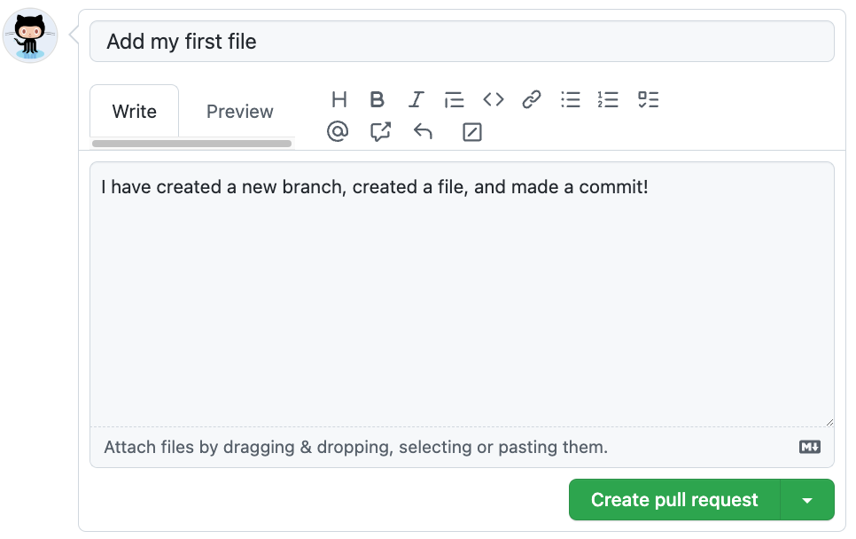

## Étape 3 : ouvrir une pull request

Ta branche contient maintenant un changement qui n'existe pas dans `main`.

### Qu'est-ce qu'une pull request ?

Une **pull request**, souvent abrégée **PR**, est une proposition de changement.

Elle compare :

- une branche **base**, ici `main`, qui est la destination ;
- une branche **compare**, ici `my-first-branch`, qui contient ton travail.

Ouvrir une pull request ne modifie pas encore `main`. Tu demandes simplement : « voici mon changement, peut-on l'intégrer ? »

### Activité : créer ta pull request

Après ton commit, GitHub peut afficher **Compare & pull request** :



Tu peux cliquer dessus. Sinon, utilise directement :

[**Créer ma pull request →**](../../compare/main...my-first-branch?expand=1)

Si tu passes par l'interface manuelle :

1. ouvre l'onglet **Pull requests** ;
2. clique sur **New pull request** ;
3. choisis :
   - **base** : `main`
   - **compare** : `my-first-branch`

   

4. Clique sur **Create pull request**.

### Donner du contexte aux autres

Une bonne PR permet de comprendre le changement sans devoir deviner son intention.

Choisis un titre court et explicite, par exemple :

```text
Ajouter mon profil
```

ou :

```text
Add PROFILE.md
```

Puis ajoute une courte description, par exemple :

```markdown
## Description

J'ai ajouté PROFILE.md afin de pratiquer mon premier cycle de contribution sur GitHub.
```



Clique enfin sur **Create pull request**.

> [!IMPORTANT]
> Mona vérifiera que le titre est suffisamment explicite et qu'une description est présente. Tu n'as plus de phrase exacte à recopier.

### Ensuite, reste dans la pull request

Une fois la PR créée, **ne reviens pas ici pour chercher la suite**.

Reste dans l'onglet **Conversation** de ta pull request. Le bot GitHub Actions y vérifiera ton travail et y publiera directement l'étape suivante.
